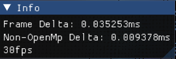

Alejandro Martinez - 21430

Arturo Argutea - 21527


ULTRA Quality: Really Slow (FHD Screen)
```bash
./Cpp.exe --voxel-size 0.005 --sphere-display-radius 0.0085 --grid-size 2.0 --iterations 4 --render-scale 0.25
```
HIGH Quality: Slow (FHD Screen)
```bash
./Cpp.exe --voxel-size 0.025 --sphere-display-radius 0.015 --grid-size 2.0 --iterations 4 --render-scale 0.5
```
REALTIME: Fast (FHD Screen)
```bash
./Cpp.exe --voxel-size 0.05 --sphere-display-radius 0.025 --grid-size 2.0 --iterations 4 --render-scale 0.5
```


ULTRA Quality: Really Slow (4k Screen)
```bash
./Cpp.exe --voxel-size 0.005 --sphere-display-radius 0.0085 --grid-size 2.0 --iterations 4 --render-scale 0.125
```
HIGH Quality: Slow (4k Screen)
```bash
./Cpp.exe --voxel-size 0.025 --sphere-display-radius 0.015 --grid-size 2.0 --iterations 4 --render-scale 0.25
```
REALTIME: Fast (4k Screen)
```bash
./Cpp.exe --voxel-size 0.05 --sphere-display-radius 0.025 --grid-size 2.0 --iterations 4 --render-scale 0.25
```

[Demo Video](Demo.mp4)

Smooth Rendering:


Different Parameters:
