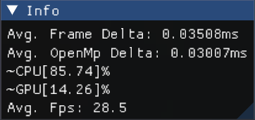
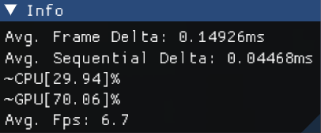
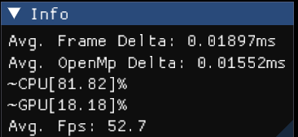
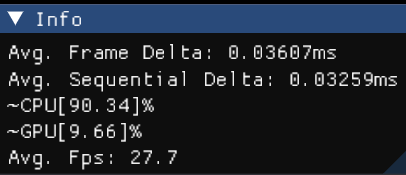
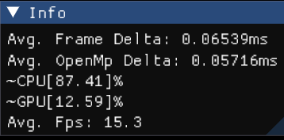
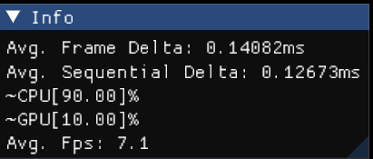
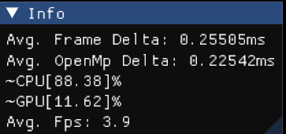
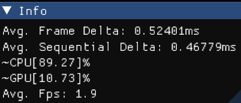

# OpenMP Stress Test
| Settings | OpenMp | Sequential |
| :------: | :----: | :--------: |
| --voxel-size 0.0005  --sphere-display-mult 1.0 --grid-size 100 50  --iterations 6.0 --render-scale 0.0625 |   |  |
| --voxel-size 0.0005  --sphere-display-mult 1.0 --grid-size 200 100 --iterations 6.0 --render-scale 0.0625 |   |  |
| --voxel-size 0.0005  --sphere-display-mult 1.0 --grid-size 400 200 --iterations 6.0 --render-scale 0.0625 |  |  |
| --voxel-size 0.0005  --sphere-display-mult 1.0 --grid-size 800 400 --iterations 6.0 --render-scale 0.0625 |  |  |
# GPU Stress Test
| Settings | OpenMp | Sequential |
| :------: | :----: | :--------: |
| --voxel-size 0.015  --sphere-display-mult 1.45 --grid-size 270 150 --iterations 4.0 --render-scale 0.125 |    |  |
| --voxel-size 0.015  --sphere-display-mult 1.45 --grid-size 270 150 --iterations 4.0 --render-scale 0.25  |  |  |
| --voxel-size 0.015  --sphere-display-mult 1.45 --grid-size 270 150 --iterations 4.0 --render-scale 0.5   |  |  |
| --voxel-size 0.015  --sphere-display-mult 1.45 --grid-size 270 150 --iterations 4.0 --render-scale 1     |  |  |